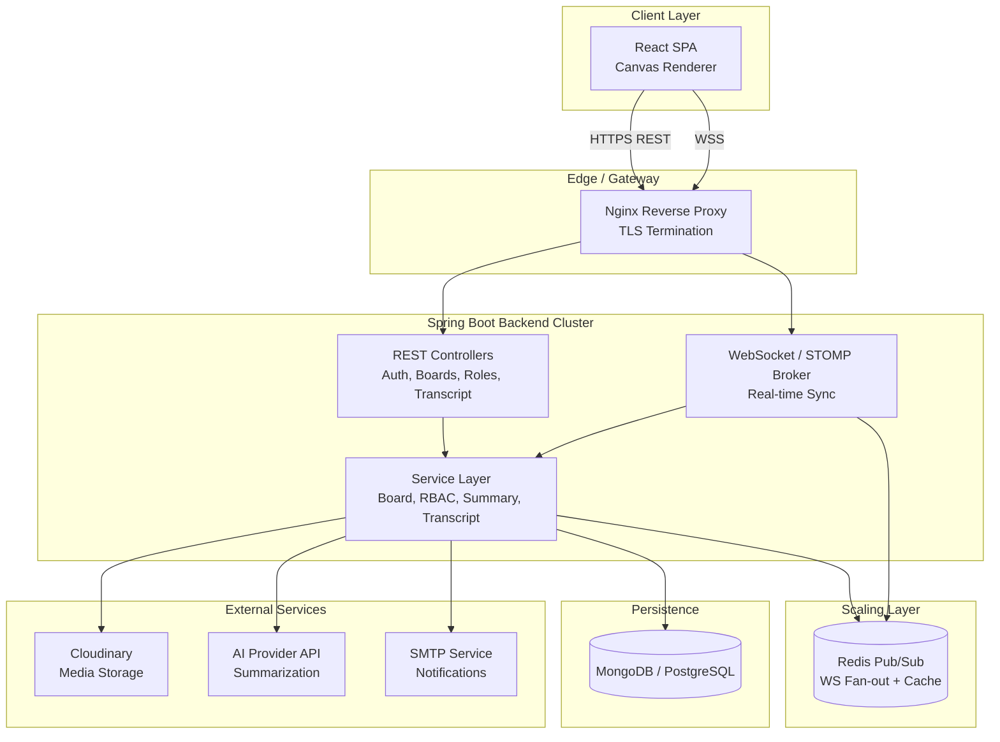
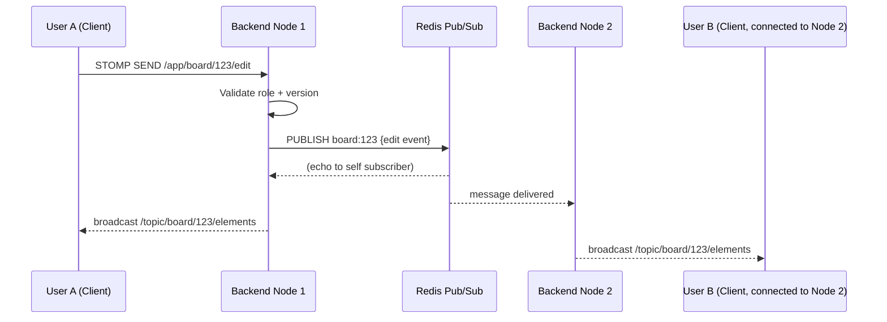
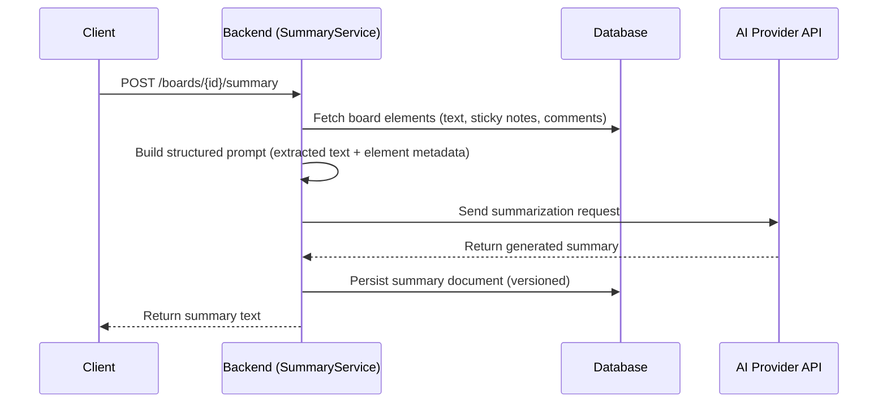

# System Design Document
## Real-Time Interactive Whiteboard Application (CollabBoard)

**Version:** 1.0
**Date:** August 13, 2026
**Companion to:** SRS_RealTime_Whiteboard.md

---

## 1. Architecture Overview

CollabBoard follows a **client-server architecture** with a stateless-where-possible Spring Boot backend, a ReactJS single-page client, a persistent database, a media CDN, and an external AI service — all containerized.



### 1.1 Deployment Topology
- Single Docker Compose stack for staging: `frontend`, `backend`, `mongo`/`postgres`, `redis`, `nginx`.
- Production: same images pushed to a container platform (ECS/K8s) with backend horizontally scaled behind Nginx/Load Balancer; Redis Pub/Sub used so WebSocket broadcasts fan out correctly across multiple backend instances.

---

## 2. Technology Stack & Justification

| Layer | Technology | Justification |
|---|---|---|
| Frontend | ReactJS + TypeScript | Component reusability, strong ecosystem, type safety for complex canvas state |
| Canvas Rendering | HTML5 Canvas (or SVG) via a custom renderer inspired by Excalidraw's `roughjs`-style hand-drawn rendering | Matches desired UX, performant for many elements |
| State Management | Zustand/Redux Toolkit | Predictable state for undo/redo and collaborative diffing |
| Backend | Java 17, Spring Boot 3.x | Mature, strongly typed, first-class WebSocket/STOMP support, team requirement |
| Real-time | Spring WebSocket + STOMP over SockJS | Native Spring integration, topic-based pub/sub model (`/topic/board/{id}`) |
| Auth | Spring Security + JWT | Stateless auth compatible with horizontal scaling |
| Database | MongoDB (primary recommendation) or PostgreSQL (alternative) | Board documents are naturally hierarchical/nested (elements array) — document DB fits well; SQL alternative provided for teams preferring relational guarantees |
| Cache/Broker | Redis | Pub/Sub for multi-instance WS fan-out; also used for session/presence caching |
| Media Storage | Cloudinary | Managed image storage/CDN with transformation API |
| AI Summarization | External LLM API (e.g., Anthropic Claude API) | Called server-side to keep API keys secret and allow prompt control |
| Containerization | Docker + Docker Compose | Required by spec; simplifies local/prod parity |
| CI/CD | GitHub Actions | Native GitHub integration, free tier sufficient |
| Reverse Proxy | Nginx | TLS termination, routing REST/WS traffic |

---

## 3. Database Design

### 3.1 Recommended: MongoDB (Document Model)

Boards are naturally nested documents (array of elements), which fits MongoDB well and avoids heavy joins for the hot read/write path (loading a board).

**`users` collection**
```json
{
  "_id": "ObjectId",
  "name": "string",
  "email": "string (unique, indexed)",
  "passwordHash": "string",
  "avatarUrl": "string",
  "authProvider": "local | google",
  "createdAt": "ISODate",
  "updatedAt": "ISODate"
}
```

**`boards` collection**
```json
{
  "_id": "ObjectId",
  "name": "string",
  "ownerId": "ObjectId (ref users)",
  "elements": [
    {
      "elementId": "uuid",
      "type": "rect | ellipse | line | arrow | freehand | text | sticky | image",
      "props": { "x": 0, "y": 0, "width": 0, "height": 0, "rotation": 0,
                 "strokeColor": "#000", "fillColor": "#fff", "text": "string",
                 "points": [[0,0]], "imageUrl": "string" },
      "zIndex": 0,
      "version": 1,
      "lastEditedBy": "ObjectId",
      "lastEditedAt": "ISODate"
    }
  ],
  "collaborators": [
    { "userId": "ObjectId", "role": "OWNER | EDITOR | COMMENTER | VIEWER", "addedAt": "ISODate" }
  ],
  "shareLink": { "token": "string", "defaultRole": "VIEWER", "expiresAt": "ISODate", "password": "hash|null" },
  "isArchived": false,
  "createdAt": "ISODate",
  "updatedAt": "ISODate"
}
```

**`transcripts` collection** (append-only, separate from `boards` to avoid unbounded doc growth)
```json
{
  "_id": "ObjectId",
  "boardId": "ObjectId (indexed)",
  "userId": "ObjectId",
  "actionType": "ELEMENT_CREATE | ELEMENT_UPDATE | ELEMENT_DELETE | COMMENT | ROLE_CHANGE | JOIN | LEAVE",
  "details": { "elementId": "uuid", "summary": "string" },
  "timestamp": "ISODate (indexed)"
}
```

**`summaries` collection**
```json
{
  "_id": "ObjectId",
  "boardId": "ObjectId (indexed)",
  "generatedBy": "ObjectId",
  "content": "string (AI-generated summary text)",
  "sourceSnapshotVersion": "int",
  "createdAt": "ISODate"
}
```

**Indexes:** `users.email` (unique), `boards.ownerId`, `boards.collaborators.userId`, `transcripts.boardId + timestamp`, `boards.shareLink.token` (unique, sparse).

### 3.2 Alternative: PostgreSQL (Relational Model)

For teams preferring SQL, the equivalent normalized schema:

```
users(id PK, name, email UNIQUE, password_hash, avatar_url, auth_provider, created_at, updated_at)

boards(id PK, name, owner_id FK->users.id, is_archived, created_at, updated_at)

board_elements(id PK, board_id FK->boards.id, element_type, props JSONB,
                z_index, version, last_edited_by FK->users.id, last_edited_at)

board_collaborators(board_id FK, user_id FK, role ENUM('OWNER','EDITOR','COMMENTER','VIEWER'),
                     added_at, PRIMARY KEY(board_id, user_id))

share_links(id PK, board_id FK, token UNIQUE, default_role, expires_at, password_hash)

transcripts(id PK, board_id FK (indexed), user_id FK, action_type, details JSONB, timestamp (indexed))

summaries(id PK, board_id FK (indexed), generated_by FK, content TEXT,
          source_snapshot_version INT, created_at)
```

Using `JSONB` for `props`/`details` keeps flexibility for varying element shapes while retaining relational integrity for users/boards/roles.

---

## 4. API Design (REST)

Base path: `/api/v1`

| Method | Endpoint | Description | Roles Allowed |
|---|---|---|---|
| POST | `/auth/register` | Register new user | Public |
| POST | `/auth/login` | Login, returns JWT + refresh token | Public |
| POST | `/auth/refresh` | Refresh access token | Authenticated |
| POST | `/auth/logout` | Invalidate refresh token | Authenticated |
| GET | `/boards` | List boards for current user | Authenticated |
| POST | `/boards` | Create a new board | Authenticated |
| GET | `/boards/{id}` | Get board details + elements snapshot | Owner/Editor/Commenter/Viewer |
| PATCH | `/boards/{id}` | Rename/archive board | Owner |
| DELETE | `/boards/{id}` | Delete board | Owner |
| POST | `/boards/{id}/duplicate` | Duplicate board | Owner/Editor |
| POST | `/boards/{id}/collaborators` | Invite collaborator with role | Owner |
| PATCH | `/boards/{id}/collaborators/{userId}` | Change collaborator role | Owner |
| DELETE | `/boards/{id}/collaborators/{userId}` | Revoke access | Owner |
| POST | `/boards/{id}/share-link` | Generate/update share link | Owner |
| POST | `/boards/{id}/summary` | Trigger AI summarization | Owner/Editor/Commenter |
| GET | `/boards/{id}/summary` | Get latest cached summary | Owner/Editor/Commenter/Viewer |
| GET | `/boards/{id}/transcript` | Get transcript (filterable by user/type/time) | Owner/Editor |
| GET | `/boards/{id}/transcript/export` | Export transcript as CSV/PDF | Owner/Editor |
| POST | `/boards/{id}/export` | Export board as PNG/SVG/PDF via Cloudinary | Owner/Editor/Viewer |
| POST | `/media/upload` | Upload image (proxied/signed to Cloudinary) | Owner/Editor |

All endpoints (except `/auth/*` and public share-link resolution) require `Authorization: Bearer <JWT>`. Server-side interceptor resolves the caller's role for the target `boardId` and enforces RBAC before delegating to the service layer.

---

## 5. WebSocket / Real-Time Design

### 5.1 Protocol
STOMP over SockJS, connecting to `wss://<host>/ws`. Clients subscribe to board-scoped topics after successful JWT handshake auth (token passed as a connect header).

**Topics:**
- `/topic/board/{boardId}/elements` — element create/update/delete broadcasts
- `/topic/board/{boardId}/cursors` — live cursor position broadcasts (throttled ~30–60ms)
- `/topic/board/{boardId}/presence` — join/leave events
- `/app/board/{boardId}/edit` — client → server destination for sending edit ops
- `/app/board/{boardId}/cursor` — client → server destination for cursor updates

### 5.2 Message Payload (Element Edit)
```json
{
  "type": "ELEMENT_UPDATE",
  "boardId": "string",
  "elementId": "uuid",
  "op": "CREATE | UPDATE | DELETE | MOVE",
  "payload": { "x": 120, "y": 340, "width": 80, "height": 40 },
  "clientVersion": 4,
  "userId": "string",
  "timestamp": 1755072000000
}
```

### 5.3 Conflict Resolution Strategy
Given a whiteboard's edit granularity (per-element, not per-character text editing), a **per-element optimistic versioning** approach is used rather than full OT/CRDT complexity:

1. Each element carries a `version` integer.
2. Client applies edits optimistically and sends `{elementId, op, payload, clientVersion}`.
3. Server checks `clientVersion` against the stored version:
   - If it matches → apply, increment version, broadcast to all subscribers (including sender, for confirmation).
   - If stale (someone else edited first) → server applies a **field-level merge** where possible (e.g., position vs. color changes don't conflict) or, for genuinely conflicting fields, applies **last-write-wins with server timestamp** and sends a corrective broadcast so all clients converge.
4. For freehand strokes (append-only point arrays), conflicts are rare since each stroke is its own element created by one user; concurrent strokes simply co-exist as separate elements.
5. This is simpler to implement correctly than full CRDT/OT, sufficient for shape/whiteboard-style editing, and can be upgraded to a CRDT-based engine (e.g., Yjs-inspired) in a future version if fine-grained concurrent text editing within a single text box becomes a priority.

### 5.4 Scaling WebSockets Across Instances
Spring's `SimpleBroker` alone doesn't fan out across multiple backend nodes. **Redis Pub/Sub** (or RabbitMQ STOMP relay) is used as the external message broker: any backend instance receiving a client message publishes to Redis; all instances subscribed to the relevant board channel forward it to their locally connected clients. This keeps the backend horizontally scalable behind a load balancer with sticky-session-free WebSocket routing.



### 5.5 Presence & Reconnection
- On connect, client sends `JOIN` with `{boardId, userId}`; server adds to Redis `presence:{boardId}` set (with TTL heartbeat) and broadcasts to `/topic/board/{id}/presence`.
- On disconnect (explicit or timeout), server removes presence entry and broadcasts `LEAVE`.
- On reconnect, client requests `GET /boards/{id}` to fetch the authoritative snapshot (with current element versions) before re-subscribing to live topics, ensuring no missed-message drift.

---

## 6. AI Summarization Design

### 6.1 Flow


### 6.2 Prompt Construction (Server-Side)
The backend extracts only textual/structural content (text elements, sticky-note text, comments, shape labels/groupings) — never raw pixel/canvas data — and constructs a structured prompt such as: *"Summarize the key themes, decisions, and action items from the following whiteboard content: [extracted text blocks + element groupings]."* The AI call happens **server-side only**, keeping API keys off the client and allowing centralized rate-limiting/caching.

### 6.3 Caching & Cost Control
- Summaries are cached per `sourceSnapshotVersion` (a hash/counter of the board's aggregate element versions). If unchanged since the last summary, the cached result is served instead of calling the AI API again.
- Rate limiting (e.g., 1 summary request per board per 30 seconds) prevents abuse and controls API cost.

---

## 7. Role-Based Access Control (RBAC) Design

| Role | View | Draw/Edit | Comment | Manage Roles | Delete Board |
|---|---|---|---|---|---|
| Owner | ✅ | ✅ | ✅ | ✅ | ✅ |
| Editor | ✅ | ✅ | ✅ | ❌ | ❌ |
| Commenter | ✅ | ❌ | ✅ | ❌ | ❌ |
| Viewer | ✅ | ❌ | ❌ | ❌ | ❌ |

**Enforcement points:**
1. **REST layer:** A `@PreAuthorize`-style method security check (custom `BoardRoleGuard`) resolves the caller's role for the `boardId` path variable before controller execution.
2. **WebSocket layer:** A `ChannelInterceptor` on `preSend` validates the STOMP session's associated role before allowing `ELEMENT_UPDATE`/`ELEMENT_CREATE`/`ELEMENT_DELETE` frames to be processed; Viewers' edit frames are rejected server-side even if a malicious client attempts to send them.
3. **Revocation:** When a role is revoked/changed, the backend publishes a control message on `/topic/board/{id}/control` instructing the affected client's session to either downgrade its local UI permissions or force-disconnect (for full revocation), and removes their subscription eligibility in Redis presence tracking.

---

## 8. Frontend Architecture (React)

```
src/
  components/
    canvas/          # CanvasRenderer, ElementLayer, CursorLayer
    toolbar/         # ToolSelector, ColorPicker, ShapeOptions
    panels/          # SummaryPanel, TranscriptPanel, SharePanel
    dashboard/       # BoardList, CreateBoardModal
  hooks/
    useWebSocket.ts  # STOMP client lifecycle, subscribe/publish
    useBoardStore.ts # Zustand store: elements, selection, undo/redo stack
    useAuth.ts
  services/
    api.ts           # Axios REST client
    wsClient.ts       # STOMP/SockJS wrapper
  pages/
    LoginPage, DashboardPage, BoardEditorPage
```

- **Rendering:** Canvas-based renderer with a virtual element list; only re-renders affected regions on update (dirty-rect optimization) for performance with large boards.
- **Local-first UX:** Edits render optimistically immediately on the local canvas, then reconciled/confirmed by the server broadcast (echoed back to sender) for consistency, per §5.3.
- **Undo/Redo:** Maintains a local command stack; undo of an element the current user last edited is straightforward, cross-user undo (undoing someone else's change) is explicitly out of scope for v1 to avoid confusing semantics.

---

## 9. Docker & Deployment Design

### 9.1 Container Layout
```yaml
# docker-compose.yml (illustrative)
services:
  frontend:
    build: ./frontend
    ports: ["3000:80"]
  backend:
    build: ./backend
    environment:
      - SPRING_DATA_MONGODB_URI=${MONGO_URI}
      - JWT_SECRET=${JWT_SECRET}
      - CLOUDINARY_URL=${CLOUDINARY_URL}
      - AI_API_KEY=${AI_API_KEY}
      - REDIS_HOST=redis
    ports: ["8080:8080"]
    depends_on: [mongo, redis]
  mongo:
    image: mongo:7
    volumes: ["mongo_data:/data/db"]
  redis:
    image: redis:7
  nginx:
    build: ./nginx
    ports: ["80:80", "443:443"]
    depends_on: [frontend, backend]
volumes:
  mongo_data:
```

### 9.2 CI/CD Pipeline (GitHub Actions)
1. **On PR:** run backend unit tests (JUnit) and frontend tests (Jest/RTL), lint (ESLint, Checkstyle).
2. **On merge to main:** build Docker images for `frontend` and `backend`, tag with commit SHA, push to a container registry (Docker Hub/GHCR).
3. **Deploy step:** SSH/webhook trigger to the target server, or platform-native deploy (ECS service update / Render deploy hook), pulling the new images and restarting via `docker-compose pull && docker-compose up -d`.

### 9.3 Production Hardening Notes
- Nginx terminates TLS (Let's Encrypt/Certbot) and proxies `/api` → backend REST, `/ws` → backend WebSocket (with `Upgrade`/`Connection` headers preserved), `/` → frontend static build.
- Secrets (JWT secret, DB URI, Cloudinary/AI API keys) injected via environment variables from a secrets manager or CI/CD encrypted secrets — never committed to the repo.
- Health check endpoints (`/actuator/health` via Spring Boot Actuator) used by the orchestrator for restart-on-failure.

---

## 10. Security Design Summary
- HTTPS/WSS enforced everywhere in production.
- Passwords hashed with BCrypt.
- JWT short-lived access tokens + rotating refresh tokens (stored httpOnly cookie or secure storage).
- Server-side authoritative RBAC checks on every REST and WS mutating action (§7).
- Input sanitization for any user-rendered text (comments, text elements) to prevent stored XSS.
- Rate limiting on auth and AI summarization endpoints.
- Signed, time-limited Cloudinary upload tokens generated server-side (client never holds the Cloudinary API secret).

---

## 11. Summary

This design uses a pragmatic **per-element optimistic-versioning sync model** (rather than full CRDT/OT) to keep the real-time engine simpler to build and reason about while still meeting the multi-user, low-latency collaboration requirement. Redis Pub/Sub decouples WebSocket fan-out from any single backend instance, enabling horizontal scaling. AI summarization and RBAC are handled entirely server-side for security and cost control. The whole stack is containerized for portability and deployed via a standard GitHub Actions → Docker Registry → server pipeline.
